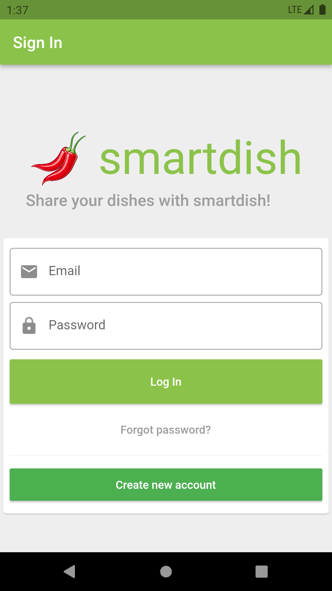
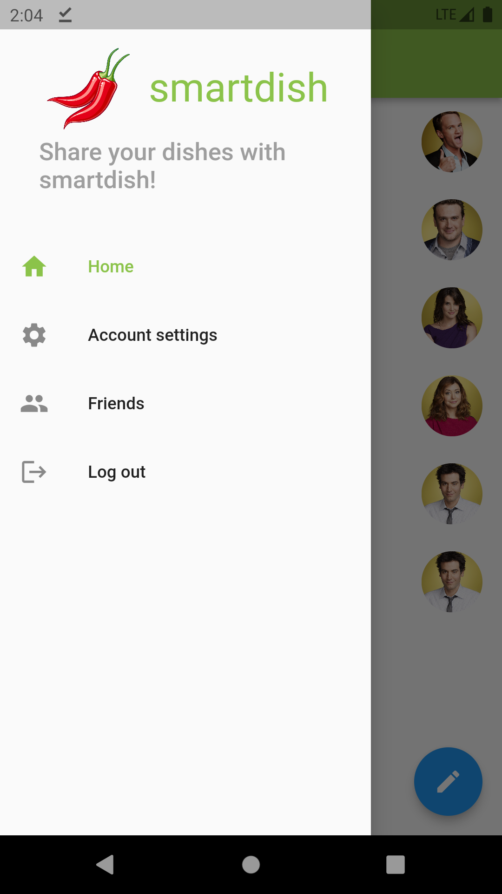
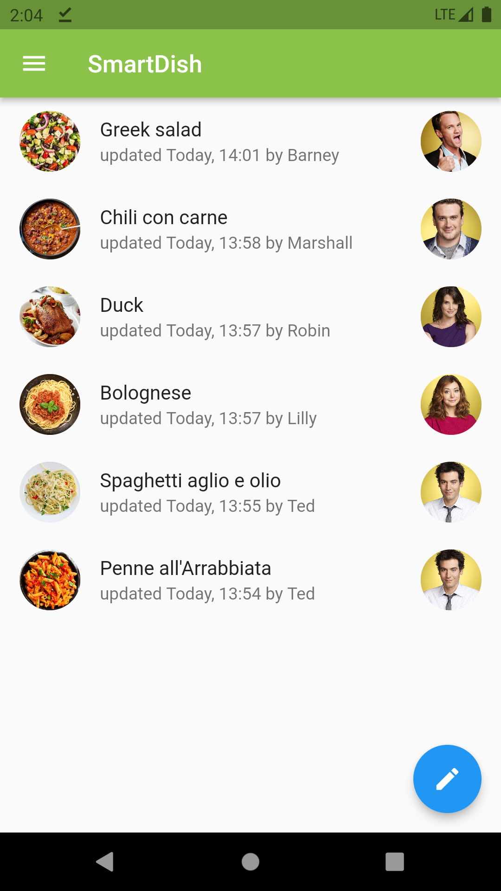
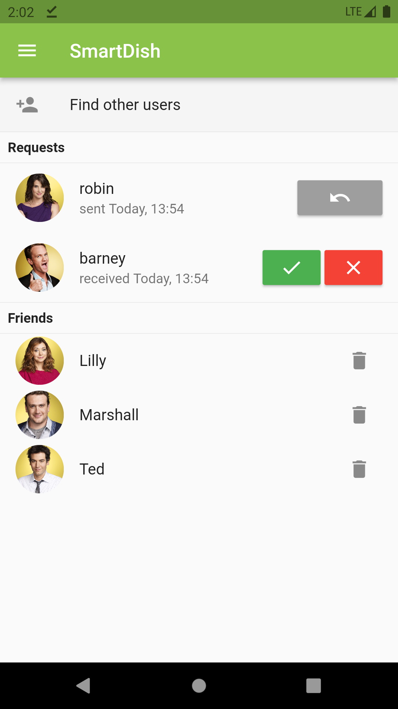
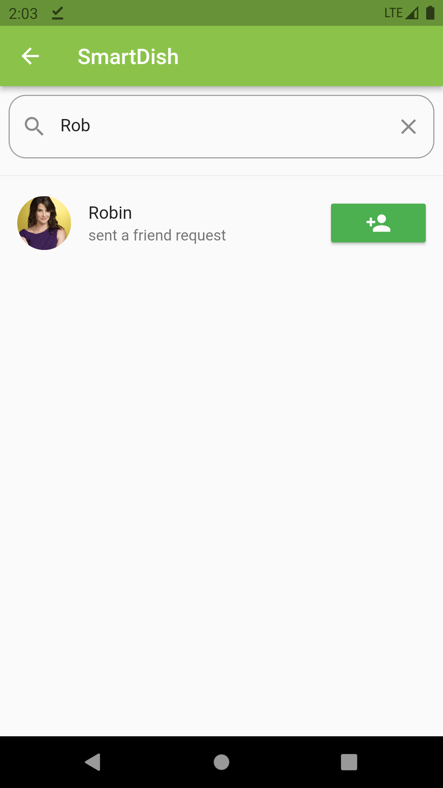
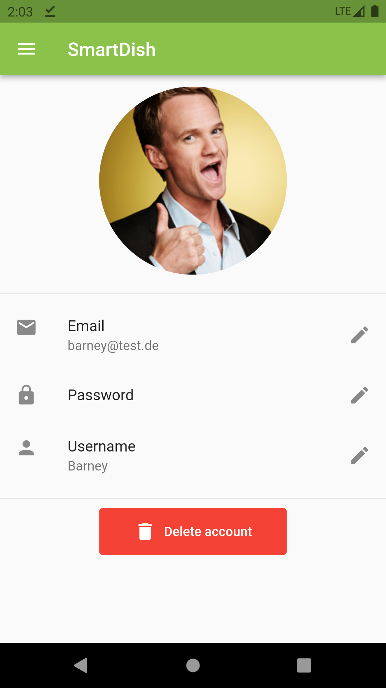

<h1>Introduction</h1>
Dear Community, 
 
with this simple social app the user can share his dishes with his friends. 
Link to the Web-App: https://smartdish-82118.web.app
<h1>Features</h1>

- Registration and login with email and password
- Search other users and send, accept, withdraw and reject friend requests
- Create, update, delete dishes
- Watch dishes of friends
- Update email address, password, user name and profile picture
- Delete account
<h1>Libraries</h1>

- Flutter: bloc, getIt DI, freezed, dartz and much more
- Firebase: Firestore, Cloud Functions, Storage, Auth, Hosting
<h1>ToDo</h1>

- Test cases
- Individual sorting of dishes
- No Internet Connection Handeling
- More details for the dishes (e.g. ingredients)
- Like / Dislike dishes
- ...
<h1>Installation</h1>
Please note that it is necessary to connect the cloned repo with an own firebase project. Otherwise it is not possible to build the project.  
App can only be run on Android and Web.
<h1>Screenshots</h1>

  
   
  

  
   
     

<h1>Licence</h1>
  
Creative Commons Lizenzvertrag 
Dieses Werk ist lizenziert unter einer Creative Commons Namensnennung-Nicht kommerziell 3.0 Deutschland Lizenz. 
 
